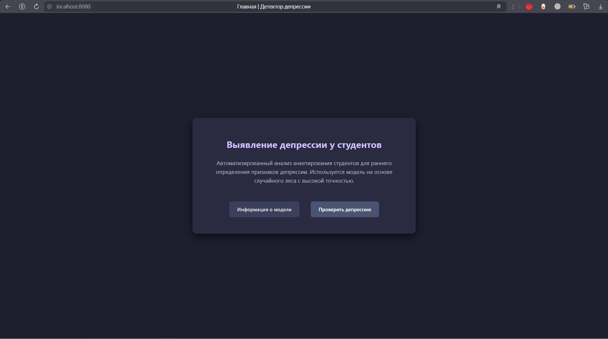
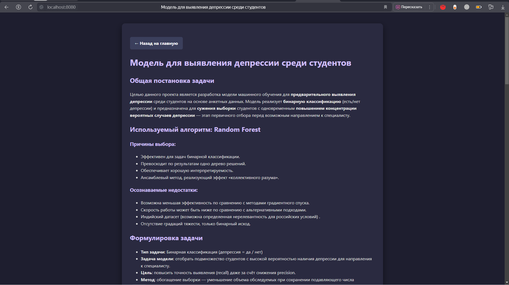
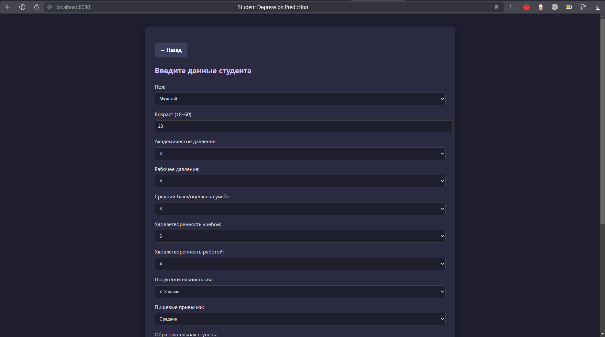
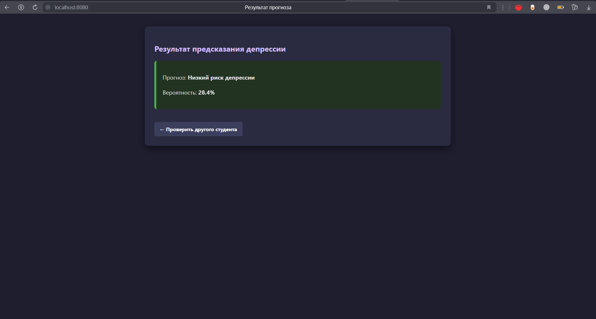

# Student depression Prediction

## Описание проекта

Этот проект представляет собой веб-приложение с моделью машинного обучения, которое предсказывает наличие депрессии у студентов.
Проект выполняется в учебной группе и построен по архитектуре MVC (Model-View-Controller), чтобы обеспечить разделение логики и удобство командной разработки.

 
<strong>Изображения </strong>

---

## Используемый стек

- Python 3.10+
- pandas
- Flask
- HTML, CSS
- Git/GitHub

---

## Архитектура

Проект разделён по веткам:

- [`help`](./docs) — инструкция по работе с git и описание проекта
- [`model`](./docs/INFO.md) — описание модели
- [`dev`](./app) — разработка пользовательского интерфейса и контроллеров

---

## Запуск проекта
Рабочая версия описана в [инструкции](docs/launch.md) 