# 🧠 Модель для выявления депрессии среди студентов

## 📌 Общая постановка задачи

Целью данного проекта является разработка модели машинного обучения для **предварительного выявления депрессии** среди студентов на основе анкетных данных. Модель реализует **бинарную классификацию** (есть/нет депрессии) и предназначена для **сужения выборки** студентов с одновременным **повышением концентрации вероятных случаев депрессии** — этап первичного отбора перед возможным направлением к специалисту.

---

## ⚙️ Используемый алгоритм: **Random Forest**

### ✅ Причины выбора:
- Эффективен для задач **бинарной классификации**.
- Превосходит по результатам **одно дерево решений**.
- Обеспечивает **хорошую интерпретируемость** с точки зрения пользователя (не «черный ящик»).
- Является **ансамблевым методом**, реализующим эффект «коллективного разума» (см. [статья на Habr](https://habr.com/ru/companies/vdsina/articles/525752/)).
- Выбор частично обусловлен субъективным интересом к алгоритму.

### ⚠️ Осознаваемые недостатки:
- Возможна **меньшая эффективность** по сравнению с методами градиентного бустинга.
- **Скорость работы** может быть ниже по сравнению с альтернативными подходами.
- Используется **неоптимальный подбор гиперпараметров** (поиск по сетке).
- Данные получены из **индийского датасета**, что может повлиять на релевантность для российских условий.
- Проблема грубой категоризации: **отсутствие градаций тяжести**, только бинарный исход (да/нет), что не всегда соответствует реалиям психиатрии.

---

## 🧪 Формулировка задачи

- **Тип задачи:** Бинарная классификация (`депрессия = да / нет`)
- **Задача модели:** отобрать подмножество студентов с высокой вероятностью наличия депрессии для направления к специалисту.
- **Цель:** повысить точность выявления (recall) даже за счёт снижения precision.
- **Метод:** обогащение выборки — уменьшение объема обследуемых при сохранении подавляющего числа действительно больных.

---

## 📈 Обоснование подхода
<details> <summary><strong>📌 Подробнее</strong></summary>

- **Постановка задачи:** необходимо выявлять потенциальные случаи депрессии среди студентов по набору параметров 
(задача бинарной классификации – есть/нет депрессии). Модель является первичным (одним из) способом оценки психологического состояния. 
На ее основе студентов могут отправить на дальнейшее обследование при подозрении депрессии. 
Модель нужна как механизм сужения выборки студентов с одновременным увеличением концентрации больных в выборке (процесс обогащения).

- **Обоснование подхода**: из-за того, что депрессия – одно из самых (если не самое) опасных психологических состояний необходимо, 
иметь высокую точность (высокий recall) выявления депрессии, когда она есть, при этом допускается поступиться чувствительностью модели 
(иметь низкий precision по классу депрессии).
- **Цели/задачи/методики** - из общей совокупности (тысячи студентов) с относительно невысокой долей больных отобрать меньшую совокупность, 
которая будет по крайней мере в несколько раз меньше исходной, но будет включать в себя подавляющее большинство всех больных.
</details>

---

## 📊 Метрики и сценарии оценки

### Источники по распространенности депрессии:
- 7%–60% по данным различных исследований:
  - [VeryWellMind](https://www.verywellmind.com/depression-in-college-students-7693236)
  - [Минобрнауки РФ](https://www.mn.ru/smart/minobrnauki-20-studentov-stradayut-ot-depressii-v-usloviyah-pandemii-koronavirusa)

### 2 сценария валидации:

#### Сценарий 1: Пессимистичный (60% больных)
- **Recall** (True Positive Rate): ≥ 90%
- **Precision**: ≥ 75%

#### Сценарий 2: Оптимистичный (10% больных)
- **Recall**: ≥ 90%
- **Precision**: ≥ 20%

### 📊 Целевые метрики качества модели
<details>
<summary><strong>Раскрыть</strong></summary>

### 🎯 Сценарий 1 — сбалансированные данные  
**Контекст**:  
Доля студентов с депрессией в выборке — **60%**, здоровых — **40%** (реальное распределение в исходном датасете).

**Целевые метрики**:
- **Recall (депрессия)** = **90%**  
  → 90% студентов, у которых действительно есть депрессия, модель должна корректно идентифицировать как депрессивных.
- **Precision (депрессия)** = **75%**  
  → среди студентов, предсказанных моделью как депрессивные, в 75% случаев диагноз действительно должен быть подтверждён.

---

### 📉 Сценарий 2 — несбалансированные данные  
**Контекст**:  
Оптимистичная гипотеза: **10% студентов** страдают от депрессии, **90% — здоровы**.

**Целевые метрики**:
- **Recall (депрессия)** = **90%**  
  → даже в условиях несбалансированности, модель должна улавливать подавляющее большинство настоящих случаев.
- **Precision (депрессия)** = **20%**  
  → допустим высокий уровень ложноположительных срабатываний: модель может направлять «на дообследование» и здоровых, чтобы не пропустить больных.

> Такой подход оправдан в задачах раннего выявления заболеваний, где **важна минимизация false negative (пропущенных случаев)**, даже ценой увеличения false positive.
</details>

---

## 🧾 Дополнительная информация

- Модель применяется посредством анализа анкеты из 14 вопросов.
- **Датасет:** [Student Depression Dataset (Kaggle)](https://www.kaggle.com/datasets/hopesb/student-depression-dataset)
  - Количество строк: **28 000**
  - Целевая переменная: **депрессия** (превалирует — 60%)
  - Признаки: **14** численных и категориальных параметров

---
## 📊 Результаты 

### Сценарий 1: Сбалансированные данные (60% — депрессия)

- **Порог вероятности:** `0.44`
- **Оптимальные гиперпараметры** модели:
```yaml
{
  'classifier__n_estimators': 800,
  'classifier__min_samples_split': 10,
  'classifier__min_samples_leaf': 4,
  'classifier__max_features': 'sqrt',
  'classifier__max_depth': None,
  'classifier__criterion': 'gini',
  'classifier__class_weight': 'non_balanced'
}
```
#### Матрица ошибок:
```markdown
         ┌───────────────┬───────────────┐
         │  TN = 1727    │  FP = 586     │
         ├───────────────┼───────────────┤
         │  FN = 333     │  TP = 2934    │
         └───────────────┴───────────────┘
```
| Класс         | Precision | Recall | F1-score | Support |
|---------------|-----------|--------|----------|---------|
| No Depression | 0.84      | 0.75   | 0.79     | 2313    |
| Depression    | 0.83      | 0.90   | 0.86     | 3267    |
| -             | -         | -      | -        | -       |
| **Accuracy**  |           |        | 0.84     | 5580    |
| Macro avg     | 0.84      | 0.82   | 0.83     | 5580    |
| Weighted avg  | 0.84      | 0.84   | 0.83     | 5580    |

**ROC-AUC:** `0.9135`
<details>
<summary><strong>Изображения</strong></summary>

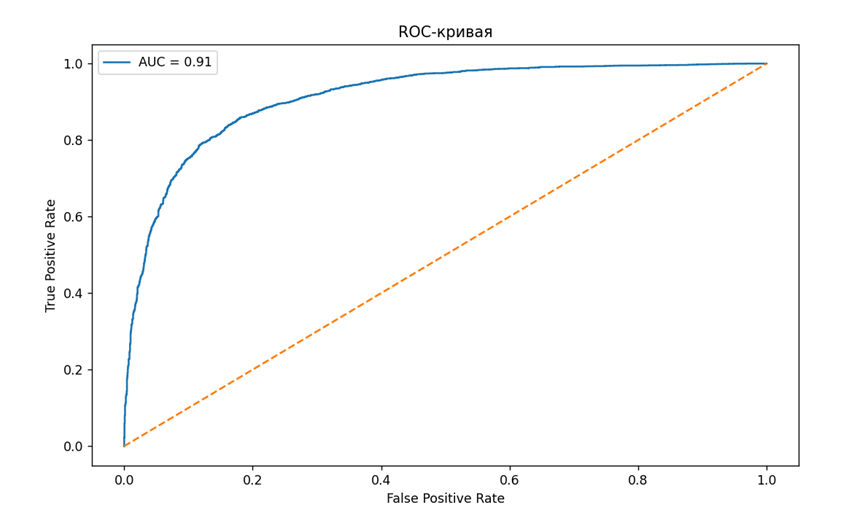

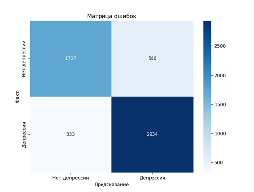
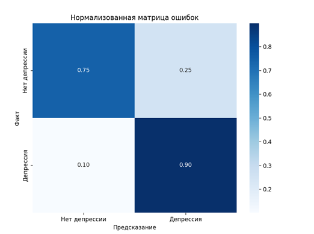
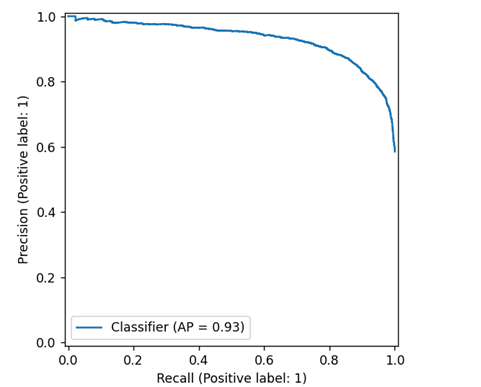
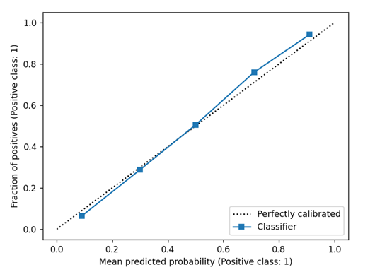

</details>

### Сценарий 2: Несбалансированные данные (10% — депрессия)
#### Порог вероятности: 0.4

#### Модель: используется та же, обучена на тех же данных
То же самое обучение, но тестовая выборка содержит 10% класса депрессия.

#### Матрица ошибок:

```markdown
         ┌───────────────┬───────────────┐
         │  TN = 1661    │  FP = 652     │
         ├───────────────┼───────────────┤
         │  FN = 16      │  TP = 241     │
         └───────────────┴───────────────┘
```

| Класс         | Precision | Recall | F1-score | Support |
|---------------|-----------|--------|----------|---------|
| No Depression | 0.99      | 0.72   | 0.83     | 2313    |
| Depression    | 0.27      | 0.94   | 0.42     | 257     |
| -             | -         | -      | -        | -       |
| **Accuracy**  |           |        | 0.74     | 2570    |
| Macro avg     | 0.63      | 0.83   | 0.63     | 2570    |
| Weighted avg  | 0.92      | 0.74   | 0.79     | 2570    |

**ROC-AUC:** `0.9253`

<details>
<summary><strong>Изображения</strong></summary>

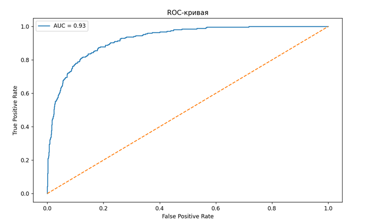
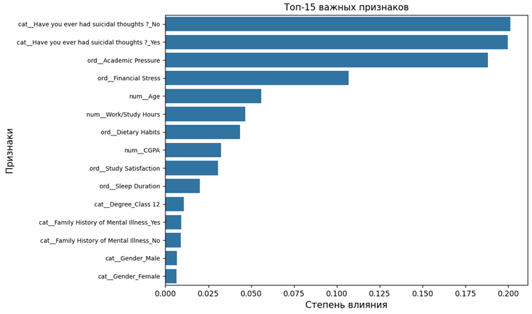
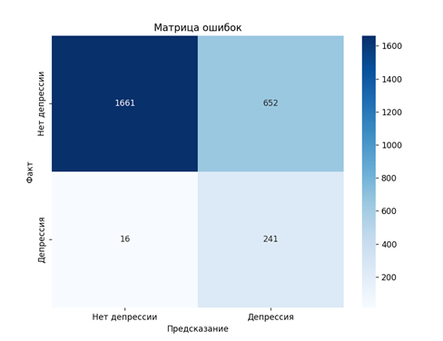
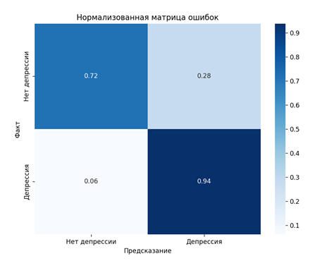
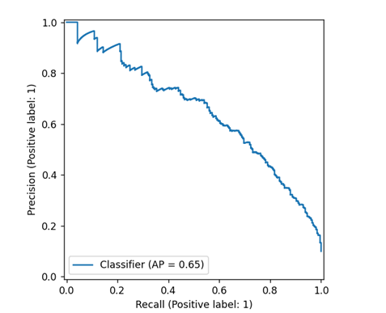
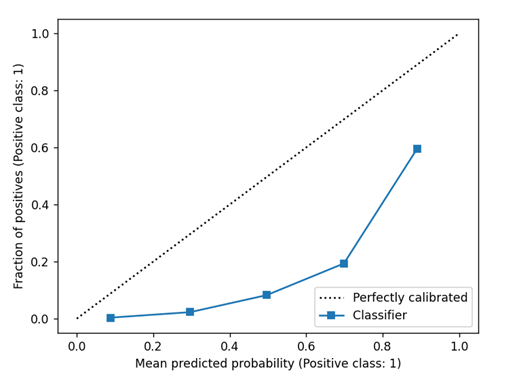

</details>

## 💡 Выводы:
- Рекомендуемый порог вероятности: 0.4–0.45 для обоих сценариев.
- Модель успешно справляется с поставленной задачей.

### Преимущества:

- Высокие значения precision и recall на сбалансированных данных.

- Отличные показатели ROC-AUC.

- Надежная работа на несбалансированных данных, в соответствии с заданными метриками.

- Хорошая обобщающая способность.

### Недостатки:

- Чувствительность к качеству обучающего датасета.

- Медленная работа на больших объемах данных.

- Применима только для бинарной классификации.

## 📌 Заключение:

Для данной задачи модель продемонстрировала высокое качество и может быть рекомендована к использованию в рамках диагностических мероприятий.

<details> <summary><strong>📘 Приложение: Расшифровка образовательных степеней (degree_options)</strong></summary>

Приведенные в degree_options обозначения представляют различные академические степени и образовательные программы.

### Бакалавриат (Bachelor's Degrees):

- B.Arch - Bachelor of Architecture (Архитектура)

- B.Com - Bachelor of Commerce (Коммерция)

- B.Ed - Bachelor of Education (Педагогика)

- B.Pharm - Bachelor of Pharmacy (Фармация)

- B.Tech - Bachelor of Technology (Технологии/Инженерия)

- BA - Bachelor of Arts (Гуманитарные науки)

- BBA - Bachelor of Business Administration (Управление бизнесом)

- BCA - Bachelor of Computer Applications (Компьютерные технологии)

- BE - Bachelor of Engineering (Инженерия)

- BHM - Bachelor of Hotel Management (Гостиничный менеджмент)

- BSc - Bachelor of Science (Естественные науки)

### Магистратура (Master's Degrees):

- LLM - Master of Laws (Юриспруденция)

- M.Com - Master of Commerce (Коммерция)

- M.Ed - Master of Education (Педагогика)

- M.Pharm - Master of Pharmacy (Фармация)

- M.Tech - Master of Technology (Технологии/Инженерия)

- MA - Master of Arts (Гуманитарные науки)

- MBA - Master of Business Administration (Управление бизнесом)

- MCA - Master of Computer Applications (Компьютерные технологии)

- ME - Master of Engineering (Инженерия)

- MHM - Master of Hotel Management (Гостиничный менеджмент)

- MSc - Master of Science (Естественные науки)

### Докторантура и профессиональные степени:

- PhD - Doctor of Philosophy (Докторская степень)

- MD - Doctor of Medicine (Медицина)

- MBBS - Bachelor of Medicine/Bachelor of Surgery (Базовое медицинское образование)

### Юридические степени:

- LLB - Bachelor of Laws (Базовая юридическая степень)

### Школьное образование:

- Class 12 - 12-й класс школы (в некоторых странах, например в Индии, это последний класс среднего образования)

### Прочие:

- Others - Другие варианты, не вошедшие в список

</details> 