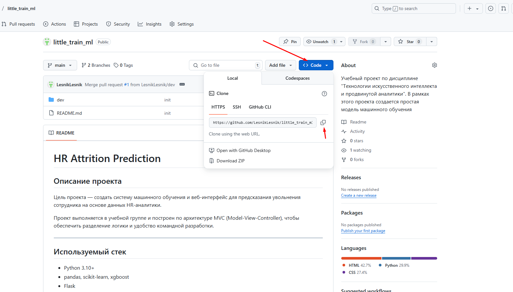
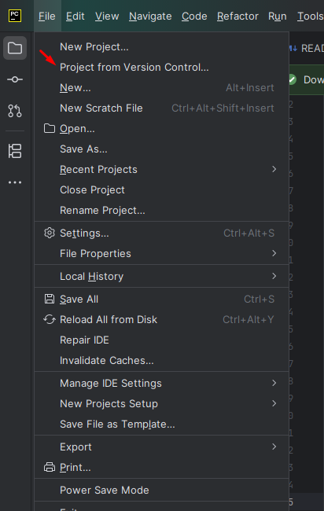
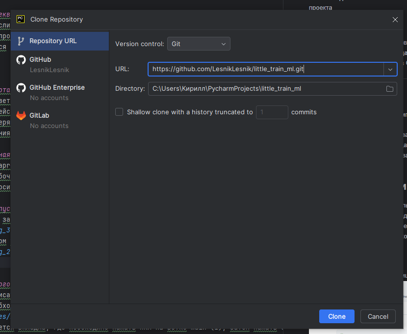

# А как запустить?

❗️❗️❗️ В сервисе предусмотрена логика автоматической загрузки модели при первом запуске приложения. 
Если вдруг она не скачалась самостоятельно, найти ее можно по [ссылке](https://disk.yandex.ru/d/IonIz-UDdiYltw).
Необходимо загруженный файл pkl положить в директорию *ml/model/student_depression_model.pkl*

Если после скачивания модели не срабатывает предсказание, необходимо попробовать перезапустить программу

## 🔧 Вариант 1: Локальный запуск (без Docker)

### 📌 Требования:
- Python 3.10 или выше
- pip (менеджер пакетов Python)

1) В браузере на заглавной странице проекта нажимаем синюю кнопку <>code и копируем ссылку

2) В верхнем левом углу, внутри меню, выбираем Project from Version Control, выбираем нужную директорию (или оставляем как есть), вставляем полученную ссылку и нажимаем clone
- 


3) Далее переходим в терминал Alt+F12
4) Установить зависимости:

  ```bash
    pip install -r requirements.txt
  ```
5) Подождать пока все скачается и установится. Запустить приложение:
  ```bash
    python run.py
  ```
6) Открыть в браузере: http://localhost:8080

## 📌 Что такое Docker?

**Docker** — это инструмент, который позволяет запускать приложения в изолированной среде, называемой **контейнером**. Контейнер — это как мини-компьютер внутри вашего компьютера: всё нужное для запуска проекта (Python, библиотеки, код) уже упаковано внутри.

С помощью Docker вы можете:
- Запускать проекты без ручной настройки Python, pip и зависимостей.
- Убедиться, что приложение работает одинаково на любом компьютере.
- Делиться проектом в виде единого файла (контейнера), который можно запустить одной командой.

---
## 🐳 Вариант 2: Запуск через Docker Compose
### 📥 Установка Docker

1. Перейдите на официальный сайт:
   👉 https://www.docker.com/products/docker-desktop/

2. Скачайте **Docker Desktop** для вашей системы (Windows или Mac).
   - Для Windows может потребоваться **WSL 2**. Инструкция по установке WSL:  
     👉 https://learn.microsoft.com/ru-ru/windows/wsl/install

3. Установите Docker, следуя инструкции на экране.

4. После установки **перезагрузите компьютер** и **запустите Docker Desktop**.

5. Проверьте, что Docker работает:
   Откройте командную строку или PowerShell и выполните:
   ```bash
   docker --version
   ```
## 🚀 Как запустить проект с помощью Docker
1. Склонируйте или загрузите этот проект (если до сих пор почему-то это не сделано):
    ```bash
    git clone https://github.com/LesnikLesnik/little_train_ml.git
    cd little_train_ml
   ```
2. Скачайте заранее собранный образ (image) с уже готовым приложением:
    ```bash
    docker pull lesniklesnik/ml-project-depression:latest
3. C запущенным приложением Docker Desktop выполните команду:
   ```bash
   docker-compose up
   ```
   
4. Готово!
Зайдите в браузере на:
👉 http://localhost:8080