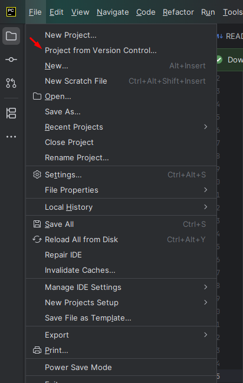
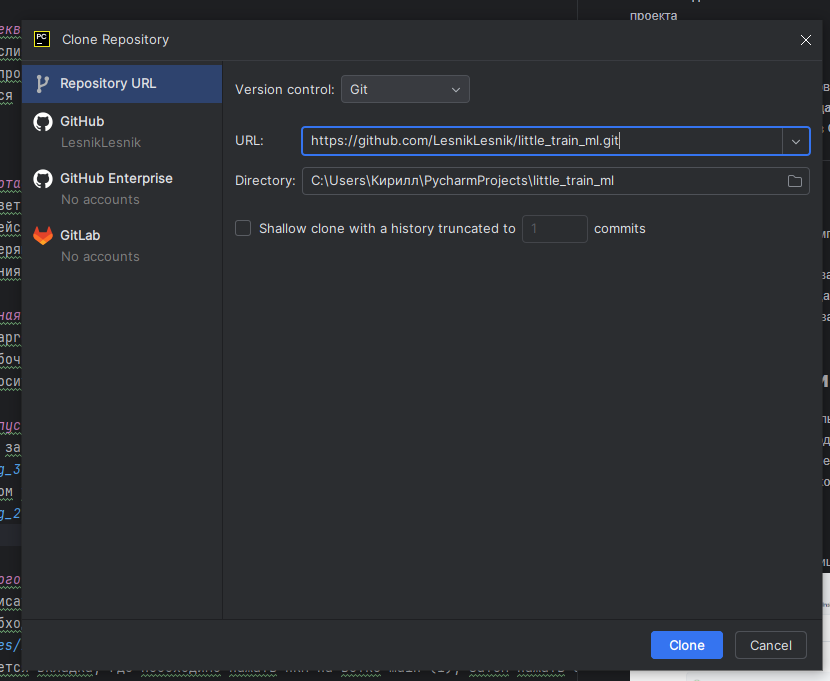
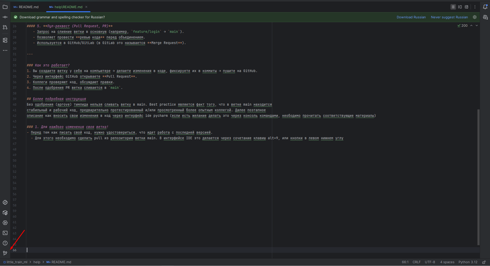
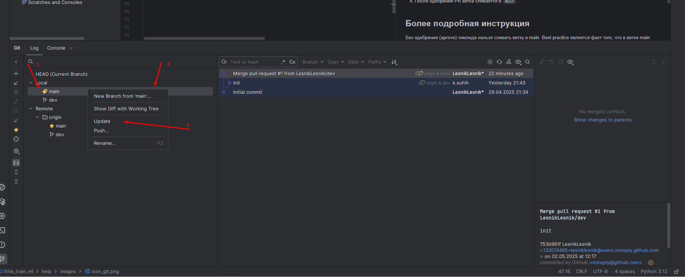
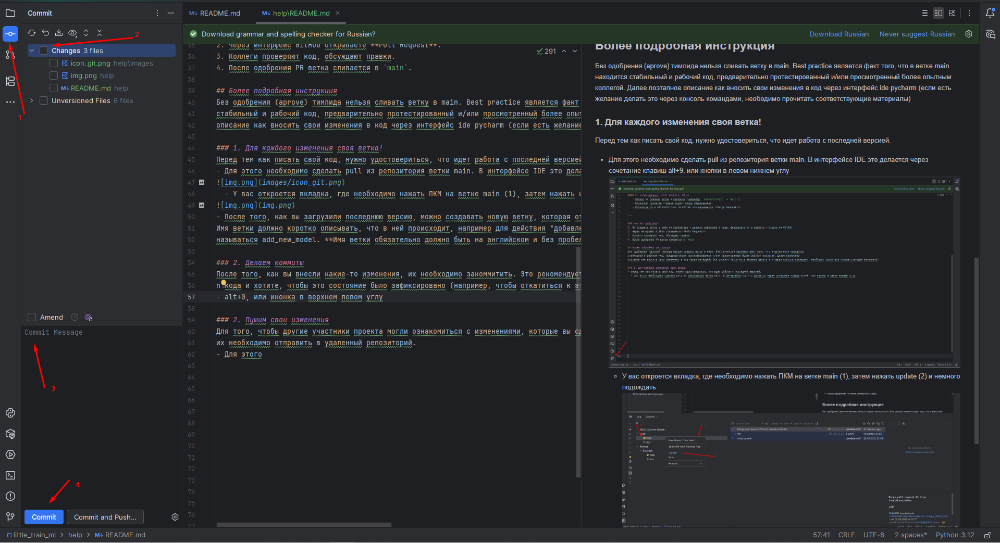

# Инструкция по работе с Git
## Что такое git?
Git это инструмент для совместной работы, ставший стандартом в отрасли. Он позволяет разным участникам проекта вносить 
свои изменения, а также удобно отслеживать эти изменения. Вся история изменений хранится в удаленном репозитории (хранилище),
в нашем случае это Github. 
### Основные понятия Git  

#### 1. **Ветка (Branch)**  
   - Это независимая линия разработки в репозитории.  
   - Позволяет работать над разными задачами параллельно, не мешая основной версии кода.  
   - По умолчанию создается ветка `main` (или `master` в старых репозиториях).

#### 2. **Коммит (Commit)**  
   - Фиксация изменений в репозитории с комментарием.  
   - Каждый коммит имеет уникальный хеш (например, `a1b2c3d`).  
   - Сохраняет историю изменений, чтобы можно было откатиться.

#### 3. **Пуш (Push)**  
   - Отправка локальных коммитов в удаленный репозиторий (например, на GitHub).  
   - Без `push` ваши изменения не попадут на сервер и другие участники проекта их не увидят.

#### 4. **Пул (Pull)**  
   - Загрузка изменений с удаленного репозитория в локальный.  
   - Эта команда позволяет на вашем локальном компьютере получить изменения, внесенные другим участником проекта

#### 5. **Пул-реквест (Pull Request, PR)**  
   - Запрос на слияние ветки в основную (например, `feature/login` → `main`).  
   - Позволяет провести **ревью кода** перед объединением.  
   - Используется в GitHub/GitLab (в GitLab это называется **Merge Request**).  

---

### Как это работает?  
1. Вы создаете ветку у себя на компьютере → делаете изменения в коде, фиксируете их в коммиты → пушите на GitHub.  
2. Через интерфейс GitHub открываете **Pull Request**.  
3. Коллеги проверяют код, обсуждают правки.  
4. После одобрения PR ветка сливается в `main`.

## Более подробная инструкция
Без одобрения (aprove) тимлида нельзя сливать ветку в main. Best practice является факт того, что в ветке main находится
стабильный и рабочий код, предварительно протестированный и/или просмотренный более опытным коллегой. Далее поэтапное 
описание как вносить свои изменения в код через интерфейс ide pycharm (если есть желание делать это через консоль командами, неободимо прочитать соответствующие материалы) 

### 0. А как запустить?
1) В браузере на заглавной странице проекта нажимаем синюю кнопку <>code и копируем ссылку

2) В верхнем левом углу, внутри меню, выбираем Project from Version Control, выбираем нужную директорию (или оставляем как есть), вставляем полученную ссылку и нажимаем clone
- 

3) Из файле app.py нажать зеленую стрелку запуска, или пролистать этот файл вниз и там нажать зеленую стрелку запуска на последнем методе
4) Перейти в браузер, в поисковой строке вбить `localhost:8080`
5) Profit! У вас запущенно полноценное веб приложение (очень простое, но всё таки...), дальше можно работать с текущей версией интерфейса-ui

### 1. Для каждого изменения своя ветка!
Перед тем как писать свой код, нужно удостовериться, что идет работа с последней версией.
- Для этого необходимо сделать pull из репозитория ветки main. В интерфейсе IDE это делается через сочетание клавиш alt+9, или кнопки в левом нижнем углу 

  - У вас откроется вкладка, где необходимо нажать ПКМ на ветке main (1), затем нажать update (2) и немного подождать

- После того, как вы загрузили последнюю версию, можно создавать новую ветку, которая отпочковывается от main (3). 
Имя ветки должно коротко описывать, что в ней происходит, например для действия "добавление новой модели" ветка может 
называться add_new_model. **Имя ветки обязательно должно быть на английском и без пробелов!**

### 2. Делаем коммиты
После того, как вы внесли какие-то изменения, их необходимо закоммитить. Это рекомендуется делать в момент, когда вы написали
n кода и хотите, чтобы это состояние было зафиксировано (например, чтобы откатиться к этой рабочей версии кода).
- alt+0, или иконка в верхнем левом углу (1)

- Выбираем (2) необходимые файлы (можно выбрать все разом), пишем что было сделано (3), например: "добавил метод для получения размера модели"
- Нажимаем commit (4). Здесь же можно нажать commit and Push, тогда изменения сразу отправятся в удаленный репозиторий 

### 3. Пушим свои изменения
Для того, чтобы другие участники проекта могли ознакомиться с изменениями, которые вы сделали на своем локальном компьютере,
их необходимо отправить в удаленный репозиторий.
- Для этого необходимо зайти во вкладку git (см выше) и осле нажатия на ПКМ выбрать push
- Дальше уже в самом гитхабе через браузер можно оформить pull request (запрос на слияние), но лучше написать в телеге 
тимлиду с уведомлением о готовности задачи и/или с просьбой посмотреть код

