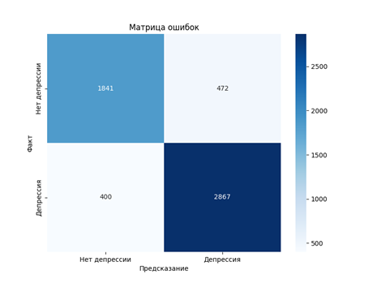
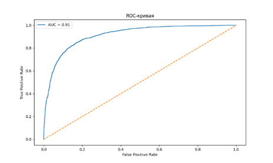
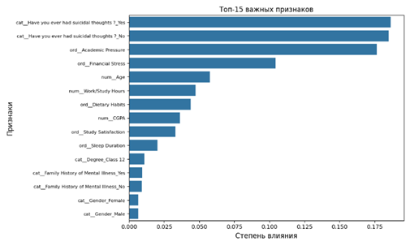
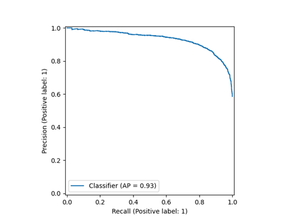
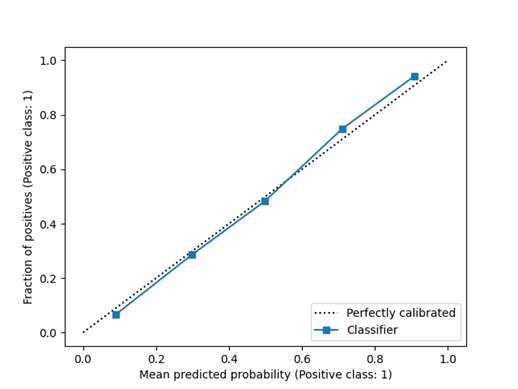

# Информация о проекте по выявлению депрессии у студентов

## 1. Постановка задачи
- **Цель**: Выявление случаев депрессии среди студентов на основе анкетирования (бинарная классификация: есть/нет депрессии)
- **Применение**: Анализ анкет из 14 вопросов
- **Датасет**: [Student Depression Dataset на Kaggle](https://www.kaggle.com/datasets/hopesb/student-depression-dataset)
  - 28 тыс. строк
  - 14 значимых признаков (числовые и категориальные)
  - Сбалансированные данные: 60% - класс "депрессия"

## 2. Алгоритм
**Модель случайного леса (Random Forest)**  
**Преимущества**:
- Оптимален для бинарной классификации
- Эффективнее простого дерева решений
- Хорошая интерпретируемость результатов
- Субъективно интереснее градиентного бустинга (хотя может уступать в скорости)

## 3. Оценка качества модели
**Лучшая модель показала**:
- Матрица ошибок:
[[1841 472]
[ 400 2867]]

- Отчет классификации:
  - precision recall f1-score support
    - No Depression 0.82 0.80 0.81 2313
    - Depression 0.86 0.88 0.87 3267

  - accuracy 0.84 5580
    - macro avg 0.84 0.84 0.84 5580
    - weighted avg 0.84 0.84 0.84 5580

  - ROC-AUC: 0.9136

## 4. Визуализации

## 5. Особенности

**Сильные стороны**:
- Высокие метрики для всех классов
- Точность предсказания депрессии: ~88%
- Общая точность модели: 84%

**Что можно обдумать/доработать**:
- Бинарный вывод (только "да/нет" без градации)
- Возможность улучшения скорости/точности с другими алгоритмами

## 6. Расшифровка академических степеней
**Бакалавриат**:
- `B.Arch` - Архитектура  
- `B.Com` - Коммерция  
- `B.Ed` - Педагогика  
- `B.Pharm` - Фармацевтика
- `B.Pharm` - Технологии/инженерия 
- etc, добавим позднее
- 
**Магистратура**:
- `LLM` - Юриспруденция  
- `M.Com` - Коммерция  
- ...  

**Докторантура/Профессиональное**:
- `PhD` - Докторская степень  
- `MD` - Медицина  

**Прочие**:
- `Class 12` - 12-й класс школы (в некоторых странах)
- `Others` - Другие программы